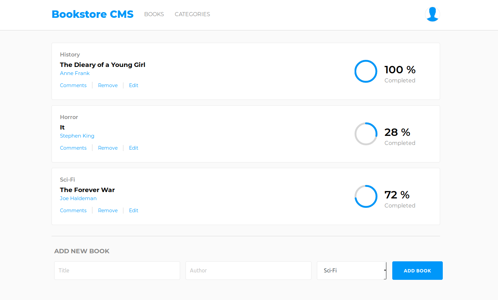

# Bookstore

#### Content Management frontend app for managing books

The backend API for this app can be found [here](https://github.com/SavaVuckovic/BookstoreAPI).

### Installing dependencies

In order to successfully install dependencies and run the application, it is required to have Node.js and npm installed. Further instructions for downloading and installing Node can be found on [official Node website](https://nodejs.org/en/).

`npm install`

### Running the application locally

In order to start the application successfully, it is required to have a ruby `sass` gem installed globally because SASS is used for styling.

`npm start`